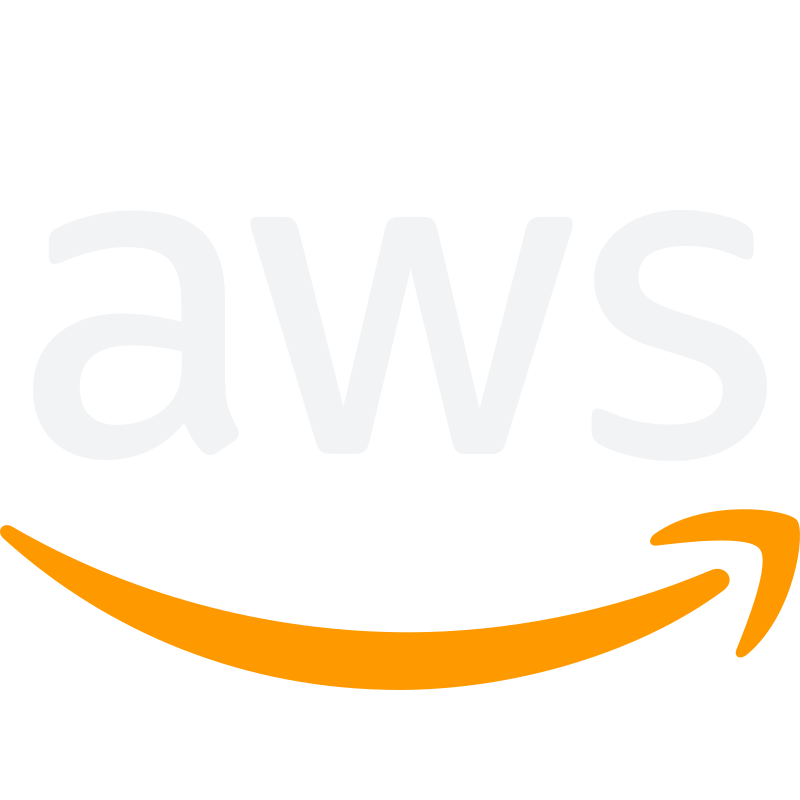

# :zap: liam-murphy14 :zap:
Hi there, my name is Liam Murphy. I am a student at Boston College and full stack engineer at [Lightyear](https://lystrategies.com).  

Check out my [website](https://liammurphydev.com) for more.

## What I like to use
### ...for work
   
### ...for school
 
### ...for everything
   

-----------

**Happy Coding !!**
